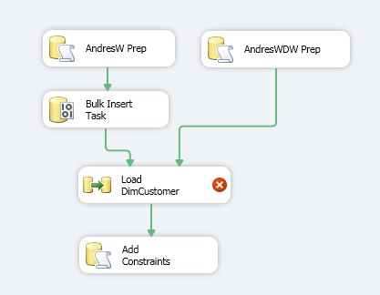
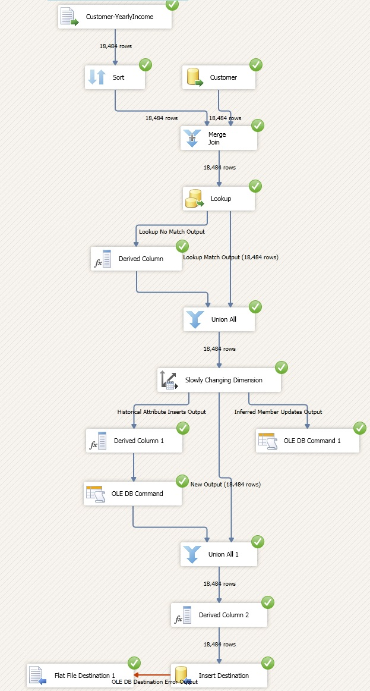

# ETL Solution for AdventureWorks

AdventureWorks is a Microsoft-supplied sample that model a fictitious bicycle company. Microsoft provided the OLTP and data warehouse. We will design and implement an ETL solution that loads dimensions from different sources, implement slowly changing dimensions (SCD), and we will build an SSIS package.

### Environment
* Microsoft SQL Server Management Studio 2012
* Microsoft SQL Server Data Tools

### Tasks
1. Creating a staging area (an empty OLAP data warehouse) containing only the database schema `Scripts`.
2. Loading data from a different source (a flat file) into a temporary OLTP database `Scripts`.
3. Adding more columns in the dimensions for SCD if they do not exist to track historical values `Scripts`.
4. Disabling single constraint in the OLAP data warehouse and at the end re-adding constraints `Scripts`.
5. Control flow view from SSIS.

  

6. Data flow view from SSIS. The customer dimension is shaped from different sources. We have data coming from the database, data coming from a flat file, and more data through a temp table via a lookup (as well as defaulting data that we don't have).
7. Type 2 SCD is implemented.

  

