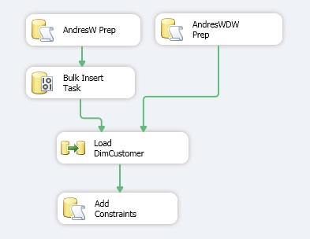

# ETL Solution for AdventureWorks

AdventureWorks is a Microsoft-supplied sample that model a fictitious bicycle company. Microsoft provided the OLTP and data warehouse. We will design and implement an ETL solution that loads dimensions from different sources (OLTP and .csv), implement slowly changing dimensions (SCD Type 2), and we will build an SSIS package.

### Environment
* Microsoft SQL Server Management Studio 2012
* Microsoft SQL Server Data Tools

### Tasks
1. Creating a staging area (an empty OLAP data warehouse) containing only the database schema `Scripts`.
2. Loading data from a different source (a flat file) into a temporary OLTP database (Bulk Insert Task) `Scripts`.
3. Adding more columns in the dimensions for SCD if they do not exist to track historical values `Scripts`.
4. Disabling single constraint in the OLAP data warehouse and at the end re-adding these constraints `Scripts`.
5. Control flow view from SSIS (Figure1).

  

6. Data Flow view from SSIS (Figure2).
7. `Customer` is an OLE DB Source to connect into our AdventureWorks OLTP world, pull all the data we need out of it to help model the custoomer dimension `Script`.
8. `Customer-YearlyIncome` is a Flat File Source of customer yearly income coming from a .csv file.
9. As we are using a `Merge Join` transformation (Left outer join), we first need to `Sort` our Flat File source .csv file. 

  

10. The `Lockup` component add more data to our temp table. In addition, we use a `Derived Column` to work with those rows that don't match. Finally, the `Union All` rejoin our default and good data. 
11. Now that we have all our the colums that we need to shape our customer dimension we are going to implement SCD.
12. Finally, we insert the data into the destination.

  

